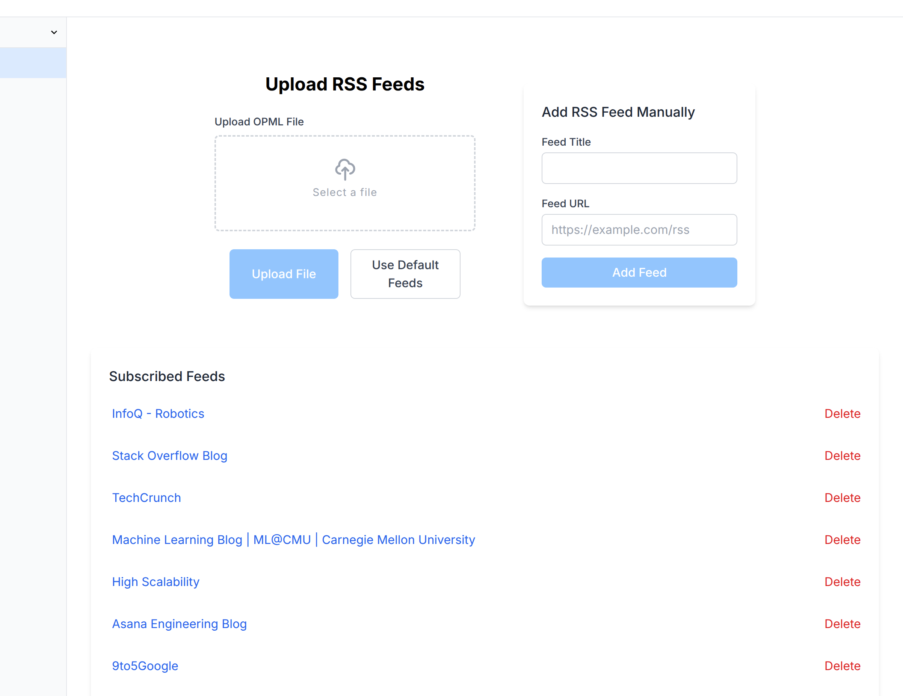
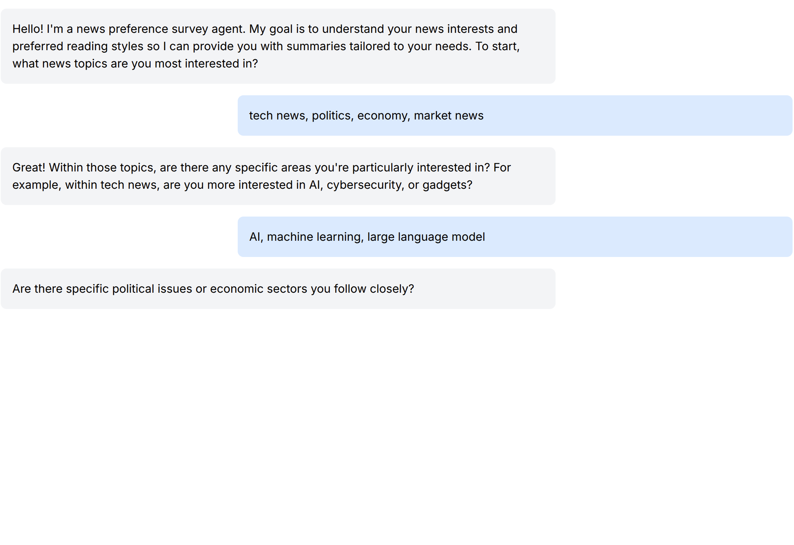
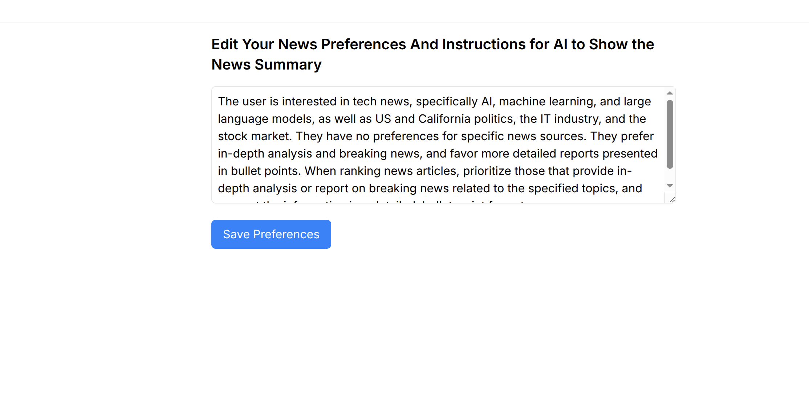
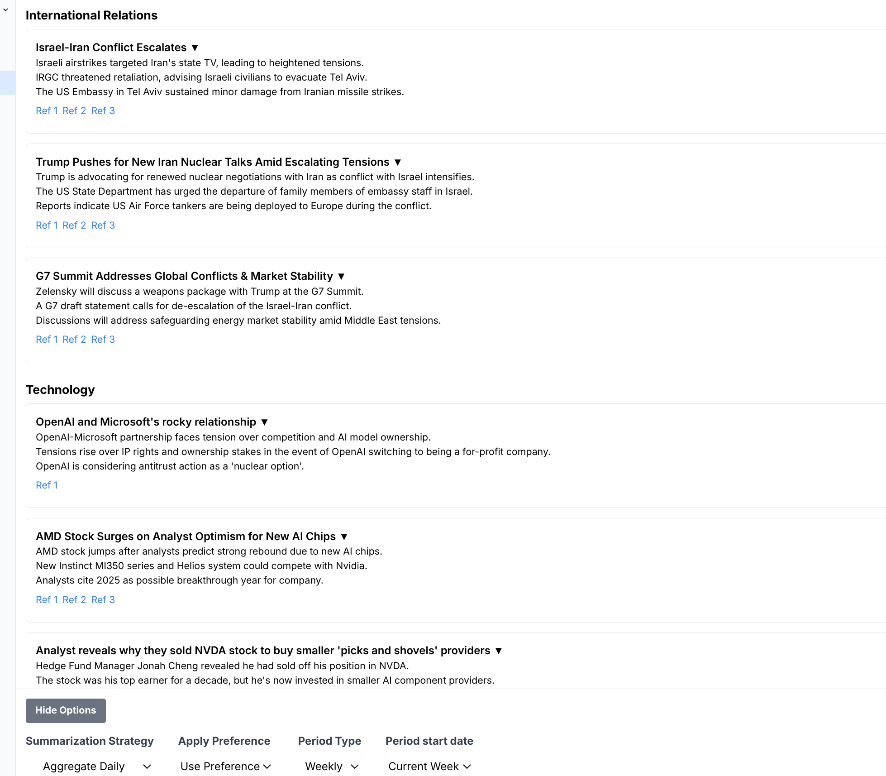
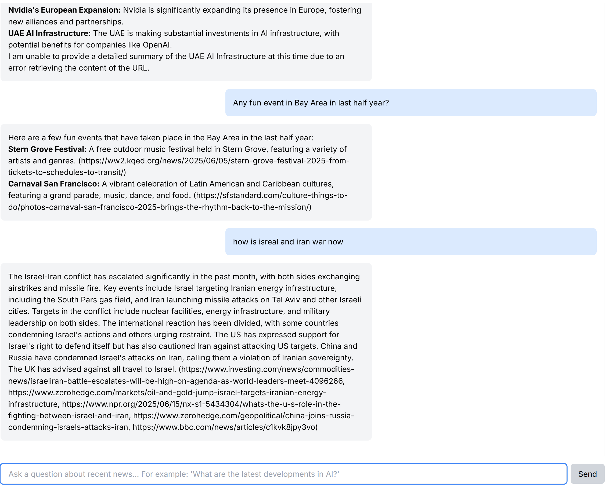
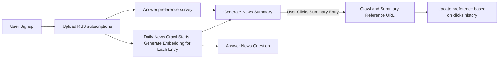
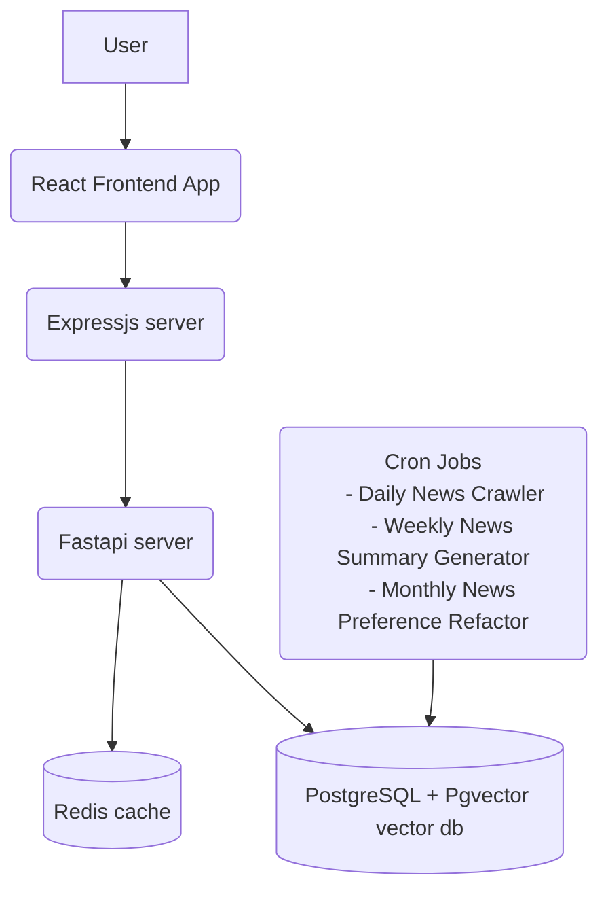
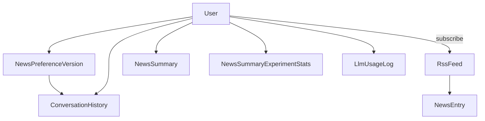
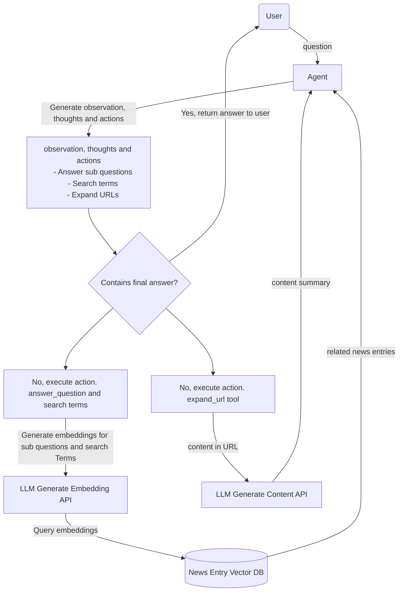

# 🚀 Introduction 
This repository contains AI apps that supercharge learning and information assimilation.  
It includes the following apps:  
- [News Summary App](#news-summary-llm-app)

---

# 🗂️ Outline
- [🛠️ Tech Stack](#tech-stack)
- [📰 News Summary LLM App](#news-summary-llm-app)
  - [❓ Problem to Solve](#problem-to-solve)
  - [🌟 Major Features and Demo](#major-features-and-demo)
  - [📈 High-Level Design](#high-level-design)
    - [👤 User Flow](#user-flow)
    - [🏗️ System Architecture](#system-architecture)
    - [🗄️ Database Schema](#database-schema-design)
  - [🔍 Detailed Solutions](#detailed-solution-and-challenges)
    - [🔗 Langchain vs Simple Proxy](#langchain-vs-simple-proxy)
    - [📝 Summary Generation Agent](#summary-generation-agent)
    - [📚 News Research Agent](#news-research-agent)
  - [📊 Agent Evaluation](#agent-evaluation)
  - [🚀 Future Improvement](#future-improvement)

---

# Tech Stack
- **Frontend:** NextJs + custom ExpressJs server + Tailwind CSS  
  - Avoid server components to simplify client-side state interaction logic.  
  - Use server components only when components are mostly independent (e.g., signin/signup page vs news summary app page).  
  - Custom ExpressJs server for flexible middleware and FastAPI proxy timeout handling.  
- **Backend:** Python FastAPI framework  
  - Lightweight and popular API framework.  
  - Python is preferred for AI-related tasks.  
- **Database:** PostgreSQL + SQLAlchemy & Redis  
  - Redis for session management and caching.  
  - PostgreSQL for relational data and vector search features.  
  - SQLAlchemy for ORM.  
- **Scheduled Task Executor:** Linux cron  
- **LLM Model:** Gemini  
  - Large context window with affordable pricing.  

---

# News Summary LLM App

## Problem to Solve
Every day, countless news articles are generated from various sources. Many are duplicates or irrelevant to individual interests. Additionally, people often lack time to read the news but still want to stay informed about trends. This app addresses these challenges by leveraging LLM technology to summarize and research news effectively.

---

## Major Features and Demo
- **RSS Subscription:** Users can subscribe to RSS channels.  
- **Daily News Crawl:** Automatically crawls news entries from RSS channels daily.  
- **Preference Survey:** LLM surveys users to understand their news preferences.  
- **News Summaries:**  
  - Generates daily or weekly summaries based on user preferences.  
  - Users can expand summary entries to fetch and summarize content from reference URLs.  
  - Updates user preferences based on click history.  
- **Question Answering:** LLM answers user questions based on crawled news (e.g., "What are the latest AI trends?").  

### Demo Screenshots  
<p style="display: flex; justify-content: space-between; flex-wrap: wrap;">
  
  
  
  
  
</p>

---

## High-Level Design

### User Flow

1. After User signup, it will ask user to upload RSS subscriptions first.  
   - Then the daily cron job will start to crawl news entries in the subscribed channels. It will also generate an embedding for each entry for future RAG use.
2. An LLM preference agent will conduct a preference survey with the user given the subscribed RSS channels.  
   - The agent will generate a text summary of user preference which will be used when generating news summary.  
   - User can also edit the preference after the survey.  
   - A monthly job will also update the preference based on the user's news summary entry click history using LLM.
3. News summary generation  
   - This app offers multiple service generation options.  
      - Aggregation algorithms: Daily aggregation vs Embedding clustering
      - Preference Application: Apply vs Not apply
      - Summary period type: Daily vs Weekly
      - Date range
   - A weekly job will summarize news based on default option per user. 
   - User can also request to generate summary with other options. 
   - [Summary generation algorithm using LLM](#summary-generation-agent) 
   - User can click a summary entry to expand it. It will visit the entry's reference URL and summarize it for the user. 
4. An LLM agent is developed to answer user's question about the latest news and trend using vector search. 
   - See [News Research Agent Algorithm](#news-research-agent)

---

### System Architecture


---

### Database Schema Design

- User
  - Contains user info like password, latest news preference, news preference version id, preferred news summary options, subscribed  
- NewsPreferenceVersion
  - Track update history of user's news preference.
- ConversationHistory
  - Conversation history between AI and users such as news preference survey conversation and news research conversation
- RssFeed
  - Not keyed by user id so that one Rss feed can be shared by multiple users and its news entry only needs to be crawled once for all users.
- NewsEntry
  - News entry data crawled every day
- NewsSummary
  - LLM generated news summary entries. keyed by user id, period type, and generation options so that news summary generated from different strategy within same period can be compared.
- NewsSummaryExperimentStats
  - Contains info like if user likes or dislikes news summary generated by a combination of options. 
- LlmUsageLog
  - Tracks llm token usage to limit the max number of tokens can be sent to LLM model every month for a user.
- ApiLatencyLog
  - Tracks API latency     

---

## Detailed Solutions

### Langchain vs Simple Proxy
I decided to use Gemini as primary LLM model because its large context window and cheap price is suitable for news summary app's use case where the input token size (all news entries from different channels in a week) is huge. But I also want to have the flexibility to switch to different LLM model in the future or use different LLM models for different tasks. Therefore I need a proxy to the LLM model. 

At the very beginning, I picked Langchain as my proxy. But then I switched to develop my own simple LLM proxy. See [LLM client proxy](backend/llm/client_proxy.py). The main reasons are:
- Langchain's Gemini model wrapper lacks a critical integration of Gemini's structured output feature. 
  - In Langchain's Gemini wrapper, structured output schema is converted to Gemini's function call schema. But Gemini's function call is unstable especially when input is large and argument number is large. Therefore it can't be used to stably generates news summary entries. After I pass the output schema to Gemini API input's native structured output field, the news summary entry is generated stably. 
- Langchain adds too unnecessary many layers above LLM model api which makes it difficult to debug LLM model api. 
  - Langchain provides some useful feature like output parser. But these features are now natively supported by LLM model api such as structured output and function call for Gemini model. So these features are not needed anymore. 
- According to software architecture principle, it is better for an organization or project to develop its own third party library proxy to avoid too much coupling with third party libraries and improve flexibility. Here the third party library I want to integrate is LLM model api. Therefore, I need my own proxy.   

---

### Summary Generation Agent
[News summary agent](backend/llm/news_summary_agent.py)
**Pseudo Code:** 
```pseudo
async def summarize_news(
    news_preference_application_experiment: NewsPreferenceApplicationExperiment,
    news_chunking_experiment: NewsChunkingExperiment,
    user_id: int,
    start_date: date,
    period: NewsSummaryPeriod,
) -> list[NewsSummaryEntry]:
    if the summary entries already exist and all news entries for that period have been crawled
        return summary entries from NewsSummary table.
    else
        if news chunking option is daily aggregation
            if period type is weekly
                generate daily summary from every day's news entries
                generate weekly summary from daily summary entries
            else if period type is daily
                generate daily summary from every day's news entries
        else if news chunking option is embedding clustering
            cluster news entries embeddings into 10 clusters.
            generate summary for each cluster.
            generate overall summary from 10 clusters' summaries. 
```

**LLM News Summary Output Schema**
```python
class NewsSummaryWithPreferenceAppliedOutput(BaseModel):
    title: str
    content: str
    reference_urls: list[str]
    should_expand: bool
    expanded_content: str | None
```
- title, content and reference_urls are summarized from input crawled news entries.
- LLM decides if to expand a news summary entry based on user preference by summarizing content in reference urls. 
- If LLM decides to expand the news summary entry but failed to crawl the URL (should_expand = true and expanded_content is None), then a local `expand_news_summary` tool will be called to expand the news entry. 

**Pseudo code for expand_news_summary**
```pseudo
for url in news_summary.reference_urls:
    crawl url content
    if url content is successfully crawled
        call LLM to summarize the content into a short paragraph and return it.

if no url can be successfully crawled:
    call LLM to do a generic search on the news entry's title and return the summary. 
```

**News Preference Application**
- A user's news preference text is embedded into summary generation prompt.
- The user's news preference could affect following things in news summary
    - Summary content
    - Summary writing style
    - Order of summary entry from more important to less important
    - If to further expand a summary entry. 

**News entry chunking strategy**
If a user subscribes to 100 Rss channels, it would crawl 1k news entries ~ 300k input tokens for LLM every day which means 2.1 million tokens every week. Therefore, it is infeasible to feed all new entries into LLM for weekly news summary generation. 
There are 2 solutions. 
1. Summarize news every day and then summarize the daily summary for weekly summary.
2. Cluster the news entry embedding and summarize each cluster's new entries first. 

For Clustering, I tried several approaches. First, I tried HDBSCAN. The advantage is that it could adaptively identify clusters based on local density. The disadvantage is that for news entry embeddings, it clusters more than 1/3 data as noise data which makes it hard to chunk and summarize the noise data. Even after tuning HDBSCAN and trying preprocessing such as PCA, the percentage of noise data is still not reduced. So I finally pick KMean which will generates n cluster without noise data. Then I feed each cluster data to LLM for summarization. Comparing to daily news aggregation approach, embedding clustering is a different chunking option. Daily news aggregation chunk news summary based on time locality while embedding clustering chunk data based on semantic locality. These 2 approaches are tackling the challenge of too large input (news entries for summarization) for LLM. 

**Summary Agent output size restriction**
Gemini only allows 8k token output for each call. If structured output is provided while output size is too large, Gemini API would output first half of the json output instead of parsed Pydantic object which makes caller harder to handle. Also I don't want llm to generate too many news summary entries. I tried different approaches. Emphasizing news summary entry limit in the prompt doesn't always work. The most reliable approach is to add a `max_items` property to output list's schema + retry on overflowed output. 

---

### News Research Agent
[News research agent](backend/llm/news_research_agent.py)
This agent is implemented with React prompt and RAG algorithm. 


**Enforce tool calling**
The news research agent has 3 optional tools to call. Sometimes Gemini api doesn't return tool calls in tool call output field. It returns tool call in text response which causes burden for application to execute tool calls. The solution is to tune tool definition to push LLM to generate tool calls in output field. 

---

### Agent Evaluation
See [detailed analysis](backend/llm/evaluation/analysis.md)

---

## Future Improvement
- Reduce news summarization and news research latency by improving llm call and function call parallelism
- Further tune summarization prompt to generate more abstract summary
- Use docker and k8s at the very beginning of the project for large scale deployment.
